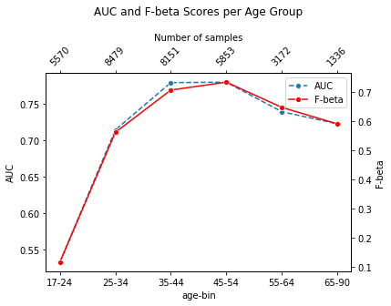

# Census Bureau Data Classifier with FastAPI, CI/CD & GitHub Actions

## 📊Project Description:
This project demonstrates the development and deployment of a binary classification model trained on the Census Bureau dataset, aimed at predicting whether a person's income exceeds $50K per year. The model is an XGBoost classifier and it was optimized and validated for various age groups, providing insights into its performance across different life stages. This is an important aspect considering the model's potential use cases in real-world applications.

FastAPI, a high-performance Python web framework, is used to serve the trained model via a RESTful API. This enables end users to interact with the model in a simple and effective way. The API is deployed to a cloud-based platform, ensuring efficient resource utilization and scalability.

In addition to a focus on deployment, the project incorporates best practices for model management, performance monitoring, versioning, and explains each step in detail via a model card. A Continuous Integration/Continuous Deployment (CI/CD) pipeline is implemented using GitHub Actions, providing automated model testing, version control, and deployment.

## 🔑 Keywords:
Classification Model, Census Bureau Data, Unit Tests, Data Slices, Model Performance, FastAPI, API Tests, Slice Validation, CI/CD Framework, GitHub Actions, XGBoost Classifier, Age-group Performance, Model Card

## 📝 Features:
- Leverages an XGBoost classifier trained on the diverse Census Bureau dataset, tackling the task of predicting whether an individual's income exceeds $50K per year.
- Model performance is evaluated across different age groups, providing insights into the model's reliability across various life stages.
- FastAPI package is used for deploying the model, providing an intuitive API for integration and consumption.
- Includes comprehensive unit tests and API tests to validate model predictions, ensuring optimal accuracy and reliability.
- Detailed model card is provided, explaining each step from data preparation and model training to performance evaluation and deployment.
- Implements a CI/CD pipeline using GitHub Actions, enabling efficient development, testing, and automated deployment of the model.

## 🌐 Live Deployment on Render
Our FastAPI application is deployed and available for use at Render. It's live and can accept POST requests. This allows for real-world applications and the ability to interact with our XGBoost classifier trained on the Census Bureau dataset.

# Results

In this section, we present key findings and results from our model's performance evaluation.

The model performance was evaluated across different age groups to provide a thorough understanding of its reliability across various life stages. Age groups were defined as follows:

- '17-24: College Age / Early Career'
- '25-34: Early Adults / Young Professionals'
- '35-44: Midlife / Settled Adults'
- '45-54: Late Midlife'
- '55-64: Pre-Retirement'
- '65-90: Retirement Age'

Each age group represented a unique life stage, allowing for a nuanced analysis of the model's performance.

The evaluation metrics used included precision, recall, F-beta score, AUC, sensitivity, and specificity. All these metrics provided a comprehensive picture of the model's overall performance and its ability to correctly predict whether an individual's income exceeds $50k per year.

The figure below summarizes the model's performance across these age groups.

  

For more details about the model's performance, hyperparameters, training steps, and cross-validation results, please refer to the [model card](model_card.md).
