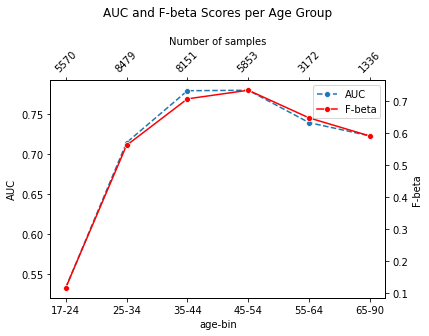

# Model Card

## Model Details
* **Model name:**  XGBClassifier
* **Model type:**  Classification
* **Model version:**  1.0
* **Date:**  May 19, 2023
* **Model implementer(s):**  Christos Zacharopoulos, Ph.D

## Intended Use
This model was trained to predict income class from a variety of census data features. It can be used to help understand income distribution across different population groups, specifically across different age groups. The initial income prediction problem was converted into a binary classification task. Instead of predicting the exact income, the model predicts whether the income is less than 50k or greater than 50k. This conversion simplifies the problem and allows us to use binary classification metrics for model evaluation.

## Factors
The model factors in various features such as age, workclass, education, marital-status, occupation, relationship, race, sex, hours-per-week.

## Metrics
The model is evaluated using the AUC-ROC score and the F-beta score. These metrics provide a balance between the Precision-Recall trade-off and the importance of correct classification in the positive class.

## Evaluation
The model was evaluated on a per age group basis using model slicing. The model was trained on the entire dataset and then tested on each age group to ensure the model performs well across all age groups. This helped identify if there was any age group that was not well-represented by the model trained on the entire population. The results for each age group can be found in the figure below:

<p align="center">
  
</p>

The above figure represents the performance of the model for different age groups. To better understand the model's behavior across various life stages, we divided the dataset into six age bins, as described below:

1. 17-24: College Age / Early Career
2. 25-34: Early Adults / Young Professionals
3. 35-44: Midlife / Settled Adults
4. 45-54: Late Midlife
5. 55-64: Pre-Retirement
6. 65-90: Retirement Age

Each age bin was then used as a separate subset for evaluating the model's performance. This process enables us to gain insights into how well the model generalizes across different age groups and helps identify any potential disparities in performance.

## Training Data
The model was trained on the UCI Adult dataset, obtained from the 1994 Census database. It's a public dataset with a variety of features about an individual, like age, workclass, education, etc., and the income class as the target variable.

## Training Procedure

The model was trained using the following procedure:

- Data was split into features (X) and target (y)
- Initialized the XGBoost model
- Defined the hyperparameters grid
- Initialized a RandomizedSearchCV object for hyperparameter tuning
- Fitted the model and found the best parameters
- Extracted the best estimator
- Initialized a KFold splitter
- For each fold, fitted the best model and calculated precision, recall, and F-beta scores
- Saved the best model to disk

## Model Evaluation Metrics
The performance of the model was evaluated using several metrics:
- Mean Precision: 0.699
- Mean Recall: 0.590
- Mean F-beta score: 0.639
- Mean AUC: 0.893
- Mean Sensitivity: 0.919
- Mean Specificity: 0.590

These metrics have the following interpretations in the context of binary classification:

- Precision: This is the proportion of positive instances that were correctly identified by the model. A high precision indicates that when the model predicts the positive class, it is likely to be correct.

- Recall (Sensitivity): This is the proportion of actual positive instances that were correctly identified by the model. A high recall indicates that the model is good at detecting positive instances.

- F-beta score: This score is a balance between precision and recall, and it is useful when one wants to emphasize the importance of one over the other.

- AUC (Area Under the ROC Curve): This metric tells us about the model's ability to distinguish between the positive and negative classes. The higher the AUC, the better the model is at making this distinction.

- Specificity: This is the proportion of actual negative instances that were correctly identified by the model. A high specificity indicates that the model is good at avoiding false positives.


## Caveats and Recommendations

While this model shows promising results, it's important to consider several caveats:

1. **Age Bias:** The model is less accurate when predicting for individuals in the 17-24 age range, indicating that it may not perform as well for younger individuals. This is a limitation of the model and needs to be addressed in future versions or other modeling approaches.

2. **Data Limitations:** The model was trained on U.S. Census data from 1994. It may not accurately reflect current socio-economic factors affecting income. For a more accurate prediction, it is recommended to train the model with recent data and take into account current trends.

3. **Binary Classification:** The model only predicts whether income is above or below $50K. It does not provide specific income predictions within those ranges, which may limit its utility in certain applications.

4. **Imbalanced Classes:** The dataset is skewed towards the less than $50K class, which may lead to bias in the model's predictions. It is recommended to balance the classes in the dataset or adjust the model to handle imbalanced data better.

5. **Model Interpretability:** XGBoost models can sometimes be difficult to interpret due to their ensemble nature. For applications where interpretability is important, simpler models or techniques like SHAP values can be used to understand the model's predictions.

## Ethical Considerations

With the use of any model predicting income classes, there are inherent ethical considerations:

1. **Data Privacy:** The data used to train this model was obtained from public datasets, but it's important to ensure the privacy of individuals' information when dealing with sensitive data like income. Always adhere to data privacy regulations and guidelines.

2. **Fairness:** The model may perform differently for different demographic groups, which raises fairness concerns. It's crucial to ensure that the model's predictions are equitable across different demographic groups.

3. **Use of Predictions:** The predictions made by this model can influence important decisions about individuals, such as loan approvals or employment decisions. It's essential to use this model responsibly and consider its limitations to prevent unjust outcomes.

4. **Transparency:** It's important to disclose the model's workings and performance metrics to the users or stakeholders to make informed decisions based on the model's predictions.

5. **Bias:** The data used to train this model may contain historical biases that can be propagated in the model's predictions. No bias investigation was made. One such investigation can happen with the Aequitas package. 

## Hyperparameters
Initial hyperparameters:

```json

    "n_estimators": [
        50,
        100,
        200
    ],
    "max_depth": [
        6,
        10,
        15
    ],
    "learning_rate": [
        0.01,
        0.1,
        0.3
    ],
    "subsample": [
        0.5,
        0.8,
        1
    ],
    "colsample_bytree": [
        0.5,
        0.8,
        1
    ]

```
- Final (best):
```json

    "objective": "binary:logistic",
    "use_label_encoder": null,
    "base_score": null,
    "booster": null,
    "callbacks": null,
    "colsample_bylevel": null,
    "colsample_bynode": null,
    "colsample_bytree": 1,
    "early_stopping_rounds": null,
    "enable_categorical": false,
    "eval_metric": "logloss",
    "feature_types": null,
    "gamma": null,
    "gpu_id": null,
    "grow_policy": null,
    "importance_type": null,
    "interaction_constraints": null,
    "learning_rate": 0.1,
    "max_bin": null,
    "max_cat_threshold": null,
    "max_cat_to_onehot": null,
    "max_delta_step": null,
    "max_depth": 6,
    "max_leaves": null,
    "min_child_weight": null,
    "missing": NaN,
    "monotone_constraints": null,
    "n_estimators": 100,
    "n_jobs": null,
    "num_parallel_tree": null,
    "predictor": null,
    "random_state": null,
    "reg_alpha": null,
    "reg_lambda": null,
    "sampling_method": null,
    "scale_pos_weight": null,
    "subsample": 0.5,
    "tree_method": null,
    "validate_parameters": null,
    "verbosity": null

```


